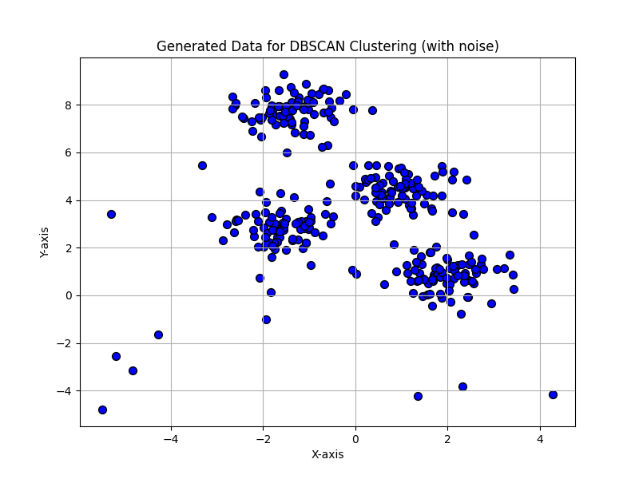
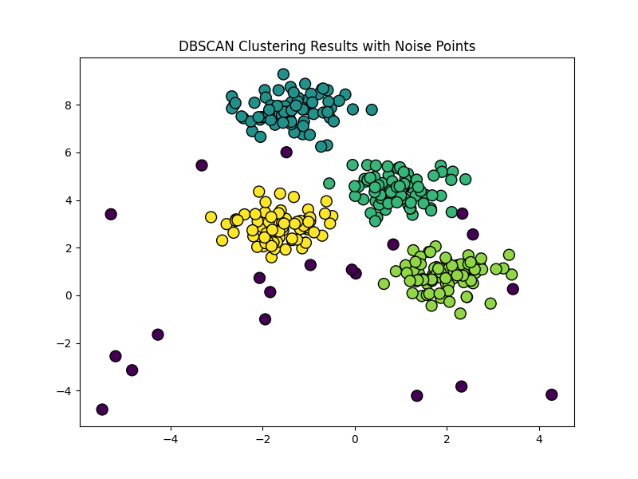

# DBSCAN Clustering from Scratch (NumPy)

This repository contains a from-scratch implementation of the **DBSCAN (Density-Based Spatial Clustering of Applications with Noise)** algorithm using **NumPy**. The purpose is to deeply understand how DBSCAN works internally without relying on high-level libraries like `sklearn.cluster`.

## 📌 Features

- Full implementation of DBSCAN using only **NumPy** and **Python's standard library**
- Distance matrix calculation with vectorized operations
- Simple queue-based expansion for density-connected points
- Handles noise and outliers
- Data generation and clustering visualization included

## 📘 Background

DBSCAN is a density-based clustering algorithm that:
- Groups together points that are close to each other (dense regions)
- Marks points that lie alone in low-density regions as outliers (noise)

Key parameters:
- `eps`: The neighborhood radius for considering neighbors
- `minPts`: Minimum number of neighbors to form a dense region

## 🧠 Implementation Details

- **Distance Function**: Computes pairwise Euclidean distance matrix using NumPy
- **Neighbor Retrieval**: Identifies all points within `eps` radius
- **Clustering Algorithm**: Expands clusters using a queue until no more density-connected points are found

## Visualization

The notebook visualizes clustered data using `matplotlib`. Data is generated with blobs and injected with uniform noise.
```python
# Generate example data with blobs
# `make_blobs` generates isotropic Gaussian blobs for clustering.
X, _ = make_blobs(n_samples=300, centers=4, cluster_std=0.60, random_state=0)
# Add some noise (outliers)
X_with_noise = np.vstack([X, np.random.uniform(low=-6, high=6, size=(20, 2))])  # Add 20 random outliers
```
<p align="center">
  
</p>

**Output**

<p align="center">
  
</p>

